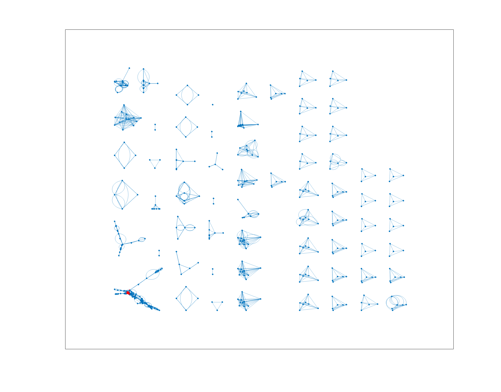

# conference-connections
graphs all connections between authors at a conference

## Description
This takes in the Insitute of Navigation (ION) program .pdf 
file for a given conference, parses through each presentation and
separates each presentation by title, author, and affiliation. Then, 
each pair of authors/organizations, are added to a graph as 
nodes/edges. After some cleaning, the connections are plotted together.

The input files include the following ION conference programs:
* PLANS23program.pdf
* GNSS23program.pdf

How to run:
* run conference_script.m 
  * make sure pad_string_arrays.m, and the pdf are in the same directory or on the same path
* May require the Text Analytics MATLAB Toolbox

### PLANS program graphs
#### Overall

#### Stanford folks

### GNSS+23 program graphs
#### Overall

#### Stanford folks

